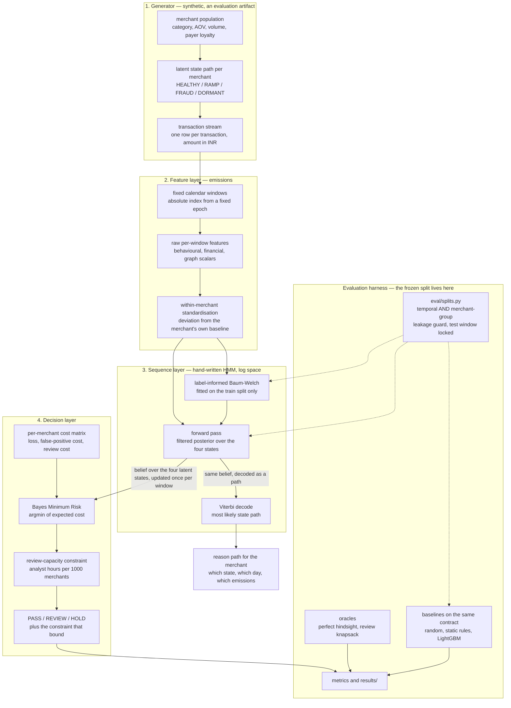

# Rakshak — Architecture

**What this document is.** A description of how a merchant's transactions become a decision that
somebody can defend on a phone call. It is written for a risk-operations reader who will not open
the code.

**What this document is not.** It contains **no results**. Not one measured number appears here,
deliberately: the design has to be legible whether the headline claim held or failed, and this
project's pre-registered claim **did not hold on the test split** (kill criterion K2 fired). The
verdict, every metric, and the provenance of each one live in `README.md` and under `results/`.
Read them before you believe anything about how well this works. This document tells you only what
was built, why it has the shape it has, and what is deliberately missing from it.

**Written:** 2026-08-30, ticket T-0018. Describes the system as shipped, gaps included.

---

## 1. The gap

Razorpay already covers two of the three moments where merchant risk shows up.

**Vulcan** scores every *transaction*, in milliseconds, as it happens. **Bumblebee** reviews every
*merchant*, once, at onboarding. Between them sits a hole large enough to drive a bust-out through:
**nothing watches a merchant who was already cleared drift from good to bad over the following
weeks.** A merchant who onboarded clean, traded normally for two months, and then began ramping
volume into a payer set that never returns is invisible to a transaction scorer — no single
transaction is anomalous — and invisible to an onboarding gate, which already ran and already
passed them. The drift surfaces when the chargebacks land, 45 to 120 days later, by which time the
money has settled and the merchant is gone.

Rakshak occupies that hole and only that hole. It is a **post-onboarding merchant sentinel**: it
does not score transactions (Vulcan owns that), it does not gate onboarding (Bumblebee owns that),
and it does not touch RTO/COD returns (Thirdwatch owns that). Those are non-goals in
`00-charter.md` §7 and reopening any of them is a re-scope, not an addition.

Arriving at the gap between two of Razorpay's own products is the strongest opening this design
has, and it is not a coincidence. It is also, per `04-patterns.md` P-01, the reason the internal
shape looks the way it does: Bumblebee runs deterministic rules first and reaches for expensive
inference only on the residual, and a CPU-only budget forces exactly the same discipline here.
Cheap deterministic window features do the aggregation; closed-form inference does the reasoning;
nothing expensive sits in the hot path.

---

## 2. The shape, in one picture

**The wire between layer 3 and layer 4 is the whole design.** What crosses it is a **belief over
latent risk states** — a probability distribution over `HEALTHY / RAMP / FRAUD / DORMANT` for this
merchant, at this window, given everything observed up to it and nothing after it. It is not a
score, and it is not a class. Every property that makes this project worth building follows from
that one choice: the decision layer can take an expected-cost argmin because it has a distribution
to take an expectation over, and the explanation layer can name a state and a date because the
same object decodes into a path. A system that put a single scalar on that wire would be a
transaction classifier wearing a merchant's name.

---

## 3. The four layers

Each layer below states what goes in, what comes out, the units, and the one decision that gave it
its shape.

### Layer 1 — Generator (`src/rakshak/generator/`)

**In:** a seed and a population geometry. **Out:** a transaction table (one row per transaction;
amounts in INR, timestamps in days from a fixed epoch) plus a **ground-truth latent state path**
per merchant, at day resolution.

Merchants are heterogeneous in category, average order value, monthly volume, payer loyalty, refund
behaviour and organic growth trend. Each walks a latent path over the horizon. A fraction are
assigned one of five typologies: bust-out, laundering endpoint, category drift, refund collusion,
and a deliberately adversarial **slow-ramp evader** whose per-window effect size is comparable to
the organic growth of a healthy merchant.

**The decision that shaped it:** the slow-ramp typology exists *so that the project can report
degraded recall on it*. It is not a typology the detector is expected to catch; it is the one that
proves the evaluation was not curated. `CLAUDE.md` forbids tuning it away.

**The safety boundary.** This module is an **evaluation artifact, not a fraud toolkit**. It writes
synthetic rows to a local parquet file. It has no payment-system client, no credential handling, no
network calls, and no interaction with any live or test payment API. Its typologies are coarse
statistical caricatures at the level of abstraction a risk analyst would draw on a whiteboard —
volume ramps, payer-graph shape, ticket-size shifts, refund rates. Read as an attack recipe, the
file says only "fraud changes a merchant's statistics", which is the premise of every fraud paper
ever published. The track is strictly defense-only and this is the one module where that has to be
argued rather than assumed.

### Layer 2 — Features / emissions (`src/rakshak/features/`)

**In:** the transaction stream. **Out:** a dense merchant × window panel of standardised emission
vectors — the observation sequence the HMM consumes.

Windows are **absolute calendar windows indexed from a fixed epoch**, not per-merchant relative
windows, so a temporal split can cut cleanly on window index. Three feature groups populate each
window from that merchant's own stream:

* **behavioural / financial** — log ticket size and its variance, velocity, refund ratio,
  chargeback ratio and lag in days, hour-of-day entropy, payment-method-mix entropy, new-payer
  ratio. All entropies in nats.
* **graph-derived scalars** — payer-set entropy, repeat-payer ratio, payer-set Jaccard similarity
  against the previous window, Herfindahl concentration on payer volume. These are the CPU stand-in
  for a graph model; see ADR-0002 and §5 below.
* **a Vulcan proxy** — window mean and 95th percentile of a per-transaction risk score, used when
  such a column is present and logged as absent when it is not. This is the seam where a real
  deployment would consume Vulcan's output rather than replace it.

Then the step that matters most. **Nothing above is comparable across merchants**: a grocer's
velocity and a jeweller's velocity live three orders of magnitude apart. `standardise.py`
normalises each feature **within the merchant** — against that merchant's own baseline — shrinking
toward a segment (MCC × AOV band) where a merchant has too little history to stand alone.

**The decision that shaped it:** *deviation from self is the signal, not deviation from the
population* (`04-patterns.md` P-02). The 2008-era cardholder HMMs compared against global norms and
drowned in false positives. This is the single most important modelling decision in the project,
and the ablation table in `results/` reports what it is worth for each model rather than assuming
it.

### Layer 3 — Sequence model (`src/rakshak/models/hmm.py`, `hmm_score.py`)

**In:** one standardised emission sequence per merchant. **Out:** a **belief over the four latent
states at each window**, plus the decoded most-likely state path.

The HMM is written by hand in numpy — forward, backward, Viterbi, Baum-Welch, all in log space
(ADR-0001). Fitting is **label-informed**: on training-split windows the responsibilities are
clamped to the known state and rare states are up-weighted in the M-step (ADR-0009). It is fitted
on the train split and nothing else.

**The decision that shaped it, and it is a constraint on the whole system:** the belief that leaves
this layer is the **forward-only filtered posterior**, `P(state at t | observations up to and
including t)`. Never the smoothed forward–backward posterior. A smoothed posterior at window *t*
conditions on windows *after* *t*, so using it to decide when the model first raised a flag is
deciding with information from the future. The distinction is one call site, it is proven by a
truncation test carrying a negative control that requires the smoothed posterior to *fail* the same
assertion, and it is the difference between a detection-lag figure and a fiction.

Two things leave the layer:

* the **belief**, collapsed for the decision layer into the mass on the bad states — this is the
  scalar the policy treats as `P(merchant is bad)`;
* the **Viterbi path**, which is not a by-product. It is the audit trail (`04-patterns.md` P-03).
  No post-hoc SHAP, no surrogate model: the explanation *is* the inference, which is why an HMM was
  chosen over a changepoint detector that would have given a date but not a state.

### Layer 4 — Decision (`src/rakshak/decision/`)

**In:** a per-merchant `P(bad)` and that merchant's own economics. **Out:** exactly one of
`PASS`, `REVIEW`, `HOLD`, the expected cost of each alternative, and the name of the constraint that
bound.

`cost.py` defines what a merchant costs. The economics are **example-dependent** — they differ per
merchant, by orders of magnitude:

* holding a good merchant costs their **expected lifetime gross margin** plus support handling —
  note *the platform's* margin on their volume, not their turnover;
* passing a bad merchant costs **realised chargeback loss** with an ancillary loading — not gross
  turnover while bad;
* reviewing costs analyst time at an hourly wage, and review is **imperfect** — an analyst miss
  probability is carried explicitly.

`policy.py` takes the Bayes Minimum Risk action: the argmin of expected cost per merchant under
that merchant's own matrix. Because the cost function is linear in `P(bad)`, the identical function
serves four purposes — expected cost under a belief, realised cost under a label, the denominator
of the savings score, and the perfect-hindsight ceiling at `P = the label`.

**The decision that shaped it: review is scarce, and scarcity is modelled rather than wished away.**
An unconstrained policy that reviews everything suspicious is not a policy. BMR is solved
unconstrained first; if the implied review hours exceed the analyst-hour budget, the lowest-regret
reviews are downgraded to their best unconstrained alternative, and the result **reports which
constraint bound** along with how many reviews unconstrained BMR *wanted*. A run in which capacity
did nothing and a run in which it bit must not look the same from the outside.

**A limitation that belongs in this section and not in a footnote.** BMR consumes each model's raw
score **as if it were a calibrated posterior**. The recalibration step that was designed for this
(ADR-0006) was cut — see §5. Under a rank-only policy, miscalibration would cost only a calibration
metric; under BMR it moves the argmin itself. Savings and calibration are therefore coupled in this
system in a way they would not be in a calibrated one, and the results files say so.

### The explanation path — built as far as the decode, no further

The Viterbi decode exists in `models/hmm.py` and is what makes the third question in §7 answerable
in principle. As of this document's date, **`src/rakshak/explain/` is an empty package**: the
merchant-facing reason string — the state transitioned into, the date, and the top emissions behind
it, plus the machine-readable `results/reasons.json` that the read-only viewer consumes — is
delivered under ticket T-0013 with the README. The inference that produces it is built; the
rendering is a separate deliverable and this document does not claim it as done.

---

## 4. Where each decision shows up in the shape

A reader should be able to point at a box in §2 and find the decision that put it there.

| ADR | Where you can see it | If it had gone the other way |
|---|---|---|
| **0001** — hand-written HMM in numpy; `hmmlearn` rejected | The whole of layer 3. Log-space forward/backward/Viterbi/Baum-Welch, no HMM library in the dependency tree | ADR-0009 would have been a library fork. A weighted, partially-supervised E-step is not exposed by any maintained HMM package |
| **0002** — no GNN, no sequence transformer; graph signal approximated by scalars | The four graph-derived features in layer 2 — payer entropy, repeat-payer ratio, Jaccard drift, Herfindahl | A heterogeneous GNN is the correct long-term answer for the laundering-endpoint typology. It needs a GPU this project does not have, and it would have been scored on the very payer graph this repo's generator wrote |
| **0003** — RL rejected, retained as a POMDP slide | The absence of a policy network, and the fact that layer 4's argmin is **one-step optimal, not sequential**. The policy is myopic and is described as myopic | Ground truth arrives 45–120 days late, so there is no reward signal inside a four-day build; and an agent trained inside our own simulator would learn our assumptions |
| **0004** — NSGA-II over NSGA-III, with a mandatory grid-search ablation | **Nothing in the diagram.** `src/rakshak/optimize/` is an empty package. Thresholds come from the closed-form BMR boundary, not from a searched Pareto frontier | Cut on schedule, not rejected — see §5 |
| **0005** — three actions under a hard review-capacity constraint | The `PASS / REVIEW / HOLD` box and the capacity box that feeds it. The third action is the product: binary allow/block discards the only action that can correct a false positive before it reaches the merchant | A two-action system has no case to examine when a held merchant calls |
| **0006** — closed-form empirical-Bayes shrinkage of per-merchant cost parameters | **Nothing in the diagram**, and that absence is load-bearing: it is why layer 4 consumes raw scores as posteriors. The intended answer to "what does your system do on a merchant with eleven transactions?" — continuous partial pooling toward the segment, with no cliff at a minimum-volume gate — is designed and unbuilt | Cut on schedule, not rejected — see §5 |
| **0007** — hybrid data: own generator for sequences, public benchmark for the decision layer | The generator box owning layer 3's data, and the separate BAF path that exercises layer 4 alone. No public merchant-sequence dataset with merchant-level risk labels exists; that is a hard boundary, not a search that ran out of time | Generator-only would make every number a statement about our own assumptions. Public-data-only means no sequence layer at all, i.e. a transaction classifier, i.e. Vulcan |
| **0008** — review capacity expressed per 1000 merchants, not as an absolute figure | The capacity box: the analyst-hour budget is derived from the size of the population being scored, so the constraint is a property of the risk-ops desk rather than of the dataset | An absolute hour figure was slack on every split in the frozen evaluation, which made the constraint decorative and collapsed precision-at-K to prevalence for every model |
| **0009** — K1 response: label-informed HMM estimation, FR-013's metric suite re-specified | The `label-informed Baum-Welch, train split only` box in layer 3 | Unsupervised Baum-Welch is measurably worse when labels exist. The re-specification also carries an unflattering finding that must travel with the design: **supervision improved the headline recovery metrics and made recall on the early-warning `RAMP` state worse.** The configuration that wins overall is the one that goes blind on the state the product premise depends on |

Two notes that a reader of `docs/adr/` should have alongside that table. **ADR-0001–0007 and
ADR-0009 were written retrospectively on 2026-08-29**, reconstructed from the specification
documents that did carry the decisions; they are dated as such and not backdated. And **ADR-0005 was
booked twice** — the three-action policy keeps 0005, the K1 response was renumbered to 0009, and the
collision is recorded rather than tidied away.

---

## 5. What is deliberately absent — and the difference between a rejection and a cut

Six things a reviewer will look for are not in the diagram. **Three were rejected on the merits, and
would still be rejected with more time. Three were decided in, specified, and then lost to the
schedule.** Conflating those two categories would flatter the project in one direction and slander
it in the other, so they are listed separately.

### Rejected by design

| Not built | Why, and why the answer would not change with another week |
|---|---|
| **Graph neural network** | GPU required, which is outside the hard constraints. And the deeper objection is one compute cannot fix: the only merchant × payer graph available is the one this repo's generator writes, so a GNN would be scored on how well it learned our own graph assumptions. **The correct long-term answer for ring-structured fraud is still a heterogeneous GNN, and this design approximates it with four scalars.** Saying so is the point (ADR-0002, `04-patterns.md` P-05) |
| **Sequence transformer** | Same GPU problem, and the best available evidence is a production fraud vendor's own research team reporting *parity* with a strong feature-engineered baseline. Spending the build window chasing parity is not a trade worth making |
| **Reinforcement learning** | The framing is genuinely apt — this is a POMDP, and the belief on the wire in §2 is exactly its sufficient statistic. It is killed by two facts, not by taste: no reward signal exists inside the build window because ground truth lags 45–120 days, and training inside our own generator learns the generator. The formulation is presented as considered-and-rejected rather than omitted, and the honest condition for reopening it is stated: a real deployment with months of realised outcomes |

### Decided in, then cut on schedule

These are not judgements that the technique is wrong. Each was specified, has an ADR recording the
decision as *accepted*, and did not get built.

| Not built | Status |
|---|---|
| **NSGA-II multi-objective threshold frontier** (ADR-0004, ticket T-0009) | **Cut** in the 2026-08-28 re-plan, behind repairs to the sequence layer's scorer and the cost matrix. **No Pareto frontier exists in this repo and none may be claimed.** The ADR's own obligation — that NSGA-II must beat an uncoupled grid search in hypervolume or be deleted as decoration — is **undischarged**, and the ablation table carries that row struck and marked *not measured*, never zero and never silently absent. What shipped instead is a single closed-form BMR threshold with the cost asymmetry swept and reported, which is a weaker claim and is described as one |
| **Empirical-Bayes shrinkage of per-merchant cost parameters** (ADR-0006, ticket T-0008) | **Cut** in the same re-plan, where it sat fourth in the cut list. The consequence turned out to be larger than the re-plan foresaw and is stated in §3: no recalibration happens anywhere in this repo, so BMR treats raw scores as posteriors. This is the strongest standing argument for reinstating the ticket |
| **BOCPD changepoint baseline** (ticket T-0010) | **Cut.** It was specified as the second *sequence-aware* baseline, so its absence leaves a question genuinely open: the only sequence-aware model measured is the HMM itself, and the repo therefore cannot separate "sequence modelling helps" from "this particular HMM helps". That question is reported as open rather than answered by implication. Note also that BOCPD was separately judged the *wrong* primary model for this problem — changepoint detection defines changepoints as abrupt, and the early-warning state here is gradual by construction — so the cut removes a baseline, not a candidate architecture |

---

## 6. How this is measured honestly

Measurement discipline is graded here more heavily than model sophistication, so the evaluation
machinery is part of the architecture rather than a wrapper around it.

**The split is two-dimensional, and it is enforced in code.** `eval/splits.py` is the only module
permitted to produce a split, and every split is the cross-product of:

* a **temporal** window — train on the early months, choose everything on a validation month, and
  hold the last months back; and
* a **merchant-group** partition — **no merchant ID crosses splits**, ever.

Neither dimension alone is sufficient. The merchant group stops per-merchant fitted parameters from
crossing over; the time window stops the future leaking into the past. A random split of this
dataset is the standard self-deception in this domain and is the first thing a reviewer checks for,
so the overlap check is a **callable assertion that runs on every load**, not a comment asking
future code to behave. Group assignment is deterministic and **does not depend on the seed** — the
frozen evaluation must not move when somebody changes a seed — and it is stratified by typology so
every split sees all five.

**One subtlety, stated because it looks like leakage and is not.** A split carries each merchant's
history from day zero up to the window end, not only the rows inside the window: a per-merchant
sequence model must see a merchant's own past to hold a belief about it. Those rows were never in
any other split and are strictly earlier than the decision point. Callers that want the window rows
alone have a separate accessor.

**The test window is locked.** Loading it requires an explicit unlock argument; the default harness
run cannot touch it. It was opened once, to render the verdict, and thresholds and capacity were
chosen on the validation window before it.

**Everything is scored through one contract.** A model is a function from a split and a random
generator to a per-merchant suspicion score, optionally with the day it first raised a flag. The
static rule engine, LightGBM, the HMM and a **uniform-random baseline** all satisfy the same
contract and are scored by the same harness with the same review budget. The random row is not a
joke: it is the floor that says how much of any savings figure was earned by detection and how much
by the shape of the cost matrix, and the results files require savings to be read against it.

**Two oracles, and a precise statement of what each does not bound.**

* The **perfect-hindsight oracle** takes the best action per merchant knowing the label. It
  dominates everything **by construction under any cost matrix**, so its passing proves nothing —
  it is a scale, not an achievement.
* The **review-knapsack oracle** is the best *review-only*, within-capacity allocation. It bounds
  the review-only action class and **does not bound a policy that can HOLD**. Whether it clears a
  trivial hold-everything policy is a property of how concentrated the loss is on a given split,
  not a property of the ceiling. Both statements are carried in the code that computes them, because
  an unqualified "we beat the oracle" or "we reach N% of the oracle" would be the more quotable and
  less true version.

**And the boundary on all of it, in the wording this project is required to use verbatim:**

> *"Sequence-layer metrics are measured on synthetic merchant streams with injected typologies; the
> generator is in this repo. The decision layer is additionally validated on BAF (Feedzai, NeurIPS
> 2022), a public benchmark derived from real bank data."*

Two amplifications the design forces, both of which belong here rather than in a footnote. First,
**the sequence layer is label-informed on synthetic generator labels** (ADR-0009) — a stronger
limitation than the plain synthetic-data caveat, and the reason nothing in this repo may describe
the sequence layer as unsupervised. Second, **BAF validates the decision layer and cannot ground the
generator**: it is bank account-opening applications with no amount, no timestamp, no payer and no
merchant, so it carries no sequences and the HMM cannot run on it at all. The separate measured
comparison of the generator's marginals against real invoice data lives in `results/` and reports
its divergences rather than closing them — including one that is **structural rather than
parametric**, meaning no setting of any generator constant would close it.

---

## 7. Why this shape, for the person who has to answer the phone

A Head of Risk Operations has three questions, and the architecture is arranged around the third
one because it is the one nobody else answers.

1. **Does it catch what we currently miss?** That is what the frozen split, the baselines and the
   random floor exist to answer, honestly and in `README.md` — including where the answer is no.
2. **How many honest merchants does it freeze, and what does that cost?** That is why layer 4 is an
   expected-cost argmin over a **per-merchant** matrix rather than a global threshold, why holding a
   good merchant is priced at lifetime margin rather than one window's revenue, and why review
   capacity is a hard constraint whose binding is reported.
3. **Can I explain the decision to the merchant when they call and shout?** That is why the sequence
   layer is a generative state model and why the belief — not a score — is what crosses the wire.
   The Viterbi path names a state and a date: *this merchant's behaviour left its own baseline on
   this day, in these ways*. The explanation is the inference, not a story told about it afterwards.

The honest form of the third answer, today, is that the inference produces the path and the
merchant-facing rendering of it ships with the README (§3). The honest form of the first is in the
results, and it is not the answer this project set out to get.

---

## 8. Reading order

| For | Read |
|---|---|
| The numbers, and what they mean | `README.md`, then `results/` |
| Why a decision was taken | `docs/adr/README.md` and the nine ADRs |
| The leakage guard, in code | `src/rakshak/eval/splits.py` |
| The cost model and the policy | `src/rakshak/decision/cost.py`, then `policy.py` |
| The inference | `src/rakshak/models/hmm.py`, then `hmm_score.py` |
| Constants, seeds, paths | `src/rakshak/config.py` |
