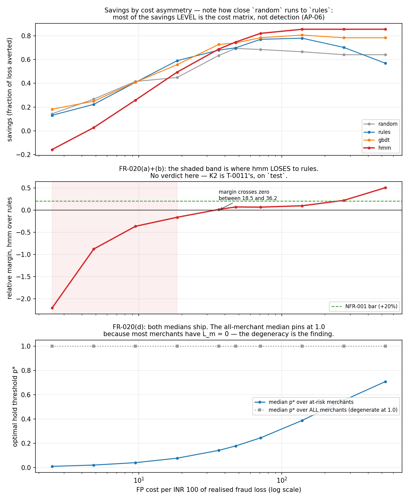

# Rakshak — cost-asymmetry sensitivity (FR-020)

> **Sequence-layer metrics are measured on synthetic merchant streams with injected typologies; the generator is in this repo.**

**No verdict is rendered here.** This table is the machinery FR-020 requires; T-0011 runs it on the `test` window and states the boundary. Everything below is the `validate` window.

## The figure (FR-020)

Drawn by `rakshak.eval.figures` from `results/sensitivity.csv`, which is the same frame that produced every table below -- the figure computes nothing of its own and cannot disagree with the tables. Regenerate it alone with `make figures`, which refits no model. **FR-020's figure clause had no owner after T-0010 was cut; it was assigned to this renderer on 2026-08-29 rather than struck.**

| Field | Value |
|---|---|
| Produced by | `python -m rakshak.decision.policy --seed 42` |
| Seed | 42 |
| Analyst-hour budget B | 0.40 h, held fixed across the sweep |
| Derived asymmetry range | 2.5 - 530.3 INR FP cost per INR 100 loss |
| Cited central asymmetry | 47.5 |
| 07-math.md §5 commentary band (cross-check, **not** a gate) | 400 - 600 |

**FR-020(c): the cited primitives produce 47.5, against a commentary band of 400-600. The divergence is stated, not closed.** The band measures *falsely declined baskets at checkout*, where the denied item is the full basket value; this ratio measures *held merchant settlements*, where the cost is the platform's own ~10 bps margin over that merchant's remaining lifetime and the fraud side is realised chargebacks rather than an abandoned cart. They were never the same asymmetry. No primitive was moved toward the band — 07-math.md §5 forbids it. The swept range runs 2.5 - 530.3, so the highest-asymmetry rows below are the closest this repo can get to what the commentary band would imply if it did apply here — read them as an illustration, not as a second operating point.

The range is **derived, not chosen**: the low end puts every numerator primitive (`P_CHURN_GIVEN_HOLD`, `GROSS_MARGIN_RATE`, `MERCHANT_LIFETIME_MONTHS`, `COST_SUPPORT_INR`) at the bottom of its `07-math.md` §5 range and every denominator primitive (`CHARGEBACK_REALISATION_RATE`, `ANCILLARY_LOADING_PHI`) at the top; the high end reverses it. Nothing between the corners is excluded and no endpoint is a literal.

**How each point is reached is not how the endpoints were derived, and that is a caveat on this table.** `asymmetry_range` reaches its corners by rescaling `value_inr` *and* `loss_inr` together with the six primitives. The sweep reproduces each asymmetry by moving the false-positive branch alone (`fp_cost_scale`), which isolates the asymmetry instead of confounding it with the absolute size of fraud loss. The two routes agree on the **ratio** and not on the whole cost matrix: `cost_review_inr` is an analyst wage and rescales with neither, so at a swept point the REVIEW branch sits at a different price relative to loss than it would at the corner that produced that same ratio. Read a row as *"this FP:loss ratio, review priced at its shipping absolute cost"*, not as *"the world in which those six primitives take their corner values"*. The savings **ordering** across models at a point is unaffected -- every model at a point faces the identical matrix -- but the asymmetry at which a crossing occurs is specific to this parameterisation.

## Savings by asymmetry

| asymmetry | random | rules | gbdt | hmm | margin abs (hmm - rules) | margin rel |
|---|---|---|---|---|---|---|
| 2.5 | +0.1435 | +0.1305 | +0.1822 | -0.1572 | -0.2877 | -220.5% |
| 4.8 | +0.2670 | +0.2228 | +0.2491 | +0.0273 | -0.1955 | -87.7% |
| 9.5 | +0.4153 | +0.4076 | +0.4089 | +0.2582 | -0.1494 | -36.6% |
| 18.5 | +0.4485 | +0.5900 | +0.5565 | +0.4937 | -0.0963 | -16.3% |
| 36.2 | +0.6338 | +0.6788 | +0.7264 | +0.6876 | +0.0088 | +1.3% |
| 47.5 | +0.6929 | +0.6980 | +0.7392 | +0.7464 | +0.0484 | +6.9% |
| 70.9 | +0.6839 | +0.7693 | +0.7832 | +0.8196 | +0.0502 | +6.5% |
| 138.6 | +0.6648 | +0.7790 | +0.8053 | +0.8541 | +0.0750 | +9.6% |
| 271.2 | +0.6400 | +0.7013 | +0.7826 | +0.8541 | +0.1528 | +21.8% |
| 530.3 | +0.6400 | +0.5680 | +0.7826 | +0.8541 | +0.2861 | +50.4% |

`margin rel` reads `n/a` where the `rules` baseline sits within 1e-6 of zero: NFR-001's >=20% bar is a *relative* margin, and a relative margin over a near-zero denominator is not a number worth printing. The absolute margin is beside it and is always defined.

**Read the `random` column before any other.** It is a uniform random score, and under BMR it posts positive savings across the whole range and beats `rules` at the low end. That is the cost matrix earning the savings, not detection — 07-math.md §6's AP-06 guard, measured. Any margin quoted off this table must be quoted against the `random` floor, not against zero.

On this split the `hmm - rules` margin turns positive between asymmetry 18.5 and 36.2, and is negative below that. **The boundary is the deliverable and it is stated rather than narrowed away** (T-0007b). It is not a verdict: this is the `validate` window, the sweep varies only the false-positive branch, and whether `00-charter.md` §2's conditional claim holds is T-0011's call on `test`.

## Capacity and thresholds (FR-017, FR-020(d))

Budget B = 0.40 h = 5 review slots, identical at every point.

| asymmetry | p* median (at risk) | p* median (all) | capacity binds for | max reviewed | max held |
|---|---|---|---|---|---|
| 2.5 | 0.0112 | 1.0000 | none | 5 | 17 |
| 4.8 | 0.0217 | 1.0000 | rules | 5 | 14 |
| 9.5 | 0.0416 | 1.0000 | random, rules, gbdt | 5 | 14 |
| 18.5 | 0.0783 | 1.0000 | random, rules, gbdt | 5 | 14 |
| 36.2 | 0.1425 | 1.0000 | random, rules, gbdt | 5 | 13 |
| 47.5 | 0.1790 | 1.0000 | random, rules, gbdt, hmm | 5 | 12 |
| 70.9 | 0.2453 | 1.0000 | random, rules, gbdt, hmm | 5 | 12 |
| 138.6 | 0.3886 | 1.0000 | random, rules, gbdt, hmm | 5 | 12 |
| 271.2 | 0.5541 | 1.0000 | random, rules, gbdt, hmm | 5 | 12 |
| 530.3 | 0.7085 | 1.0000 | random, rules, gbdt, hmm | 5 | 12 |

FR-017: `hours_used` never exceeds B at any point above, and the binding constraint is reported **per model** rather than inferred — a run where the budget did nothing and a run where it forced a downgrade must not look alike.

FR-020(d): p* = c_fp(m) / (L_m + c_fp(m) - rho L_m) is Elkan (2001)'s cost-matrix-derived threshold. **The `all` column is pinned at 1.0000 at every asymmetry and that is not a result** — 80 of these 100 merchants never transact in a bad state, so L_m = 0 and p* collapses to c_fp/c_fp = 1 by construction. The `at risk` column (L_m > 0) is the one that moves. Both are printed so the degenerate one cannot be quoted on its own.

## Where the review-only ceiling stops being a ceiling

| asymmetry | knapsack ceiling | hindsight ceiling | knapsack >= hold-everything |
|---|---|---|---|
| 2.5 | -2.1503 | +0.1985 | **no** |
| 4.8 | -1.6479 | +0.3263 | **no** |
| 9.5 | -1.0183 | +0.4865 | **no** |
| 18.5 | -0.3777 | +0.6495 | **no** |
| 36.2 | +0.1500 | +0.7837 | yes |
| 47.5 | +0.3169 | +0.8262 | yes |
| 70.9 | +0.5141 | +0.8764 | yes |
| 138.6 | +0.6069 | +0.9000 | yes |
| 271.2 | +0.6069 | +0.9000 | yes |
| 530.3 | +0.6069 | +0.9000 | yes |

**The review-knapsack ceiling falls below hold-everything at every asymmetry at or below 18.5.** T-0007a predicted exactly this in `tests/test_cost.py`'s header — *"nothing forces it above hold-everything"* — and this sweep is the first thing to measure where the boundary is. It is a property of the action class, not a defect: `review_knapsack_oracle` may only PASS and REVIEW, and under a low false-positive cost, holding is nearly free and averts nearly all loss. So the review-only ceiling is beaten by hold-everything, by every model, and by any policy allowed to hold.

**This forced a correction to T-0007a's invariant and it is recorded rather than smoothed over.** T-0007a asserted every policy against both ceilings, which was sound while the scored policy was `harness.budget_policy` (PASS and REVIEW only). T-0007b's BMR policy holds, so asserting it against a review-only ceiling fires on a category error. `assert_ceilings_dominate` now checks the hindsight ceiling against every policy and the knapsack ceiling against the review-only class, and both ceilings are reported at every point. **No constant was moved and no point was dropped from the sweep.**

With that scoping, the oracle-dominance invariant was re-checked at **every** point above, against ceilings recomputed under that point's own cost matrix, and held at every one. The table exists only because it did.

