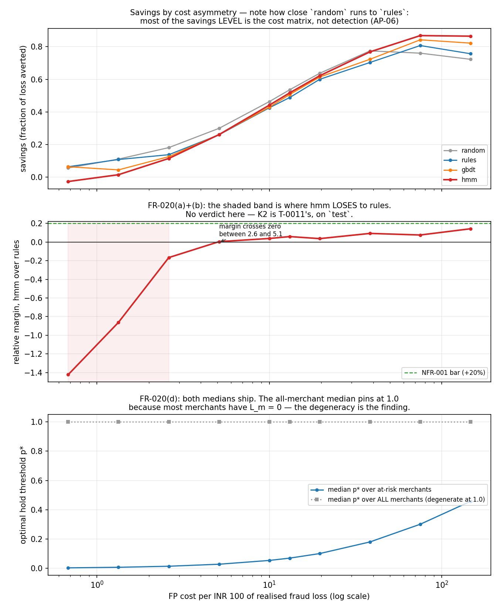

# Rakshak — K2's verdict on the held-out test window (T-0011)

> **Sequence-layer metrics are measured on synthetic merchant streams with injected typologies; the generator is in this repo.** The decision layer is additionally validated on BAF (Feedzai, NeurIPS 2022), a public benchmark derived from real bank data.

The BAF half of that sentence is backed by `results/baf_validation.md` (T-0012), on BAF's own native temporal split. **It validates the decision layer only** — BAF is account-opening applications with no sequences, so the HMM cannot run there and does not. Every number in this file is the synthetic split.

## This is the test window, and it is touched here

`06-requirements.md` §3 reserves days 210-269 for the tickets that render the final result: *"test set touched — exactly once, at the end"*. That reservation is enforced in code — `eval.splits.load_split` refuses `test` without an unlock ticket — and this run passes `unlock_test="T-0011"`. Every threshold, hyperparameter and configuration decision in this repo was made on `train` and `validate` before this file existed, and **nothing was changed after reading it**.

**One row is cleaner here than it was in `results/summary.md`.** LightGBM early-stops its iteration count on `validate`, which is the split `summary.md` reports on — so its row there is mildly optimistic and says so. Here the reported window is `test` and `validate` is only the early-stopping set, so `gbdt`'s row carries no such caveat. `rules` and `random` fit nothing and never carried it. The `hmm` is fitted on `train` alone (T-0006b).

## Provenance

| Field | Value |
|---|---|
| Produced by | `python -m rakshak.eval.verdict --seed 42` |
| Seed | 42 |
| Split reported | `test` (days 210-269), unlocked with ticket T-0011 |
| Data horizon | day 0 = 2026-01-01, 500 merchants |
| Review budget K | 5 merchants (0.40 h / 0.067 h per review) |
| Capacity rule | 4.0 analyst-hours per 1000 merchants under watch, scaled to this split's 100 merchants (ADR-0008) |
| Bad states | DORMANT, FRAUD, RAMP |
| Prevalence | 20 of 100 merchants truly bad (20.0%); generator `FRAUD_MERCHANT_RATE` = 0.20 |
| Cited central asymmetry | 13.1 INR FP cost per INR 100 of loss |
| Swept asymmetry range | 0.7 - 146.9 (derived, not chosen) |

Read every precision-like number against the prevalence: a precision of P is a lift of P / 0.20 over random selection at this base rate, and this base rate is far above a real merchant book's.

**The cited central asymmetry reads 13.1 here against 47.5 on `validate`, and that is a property of the population rather than a constant.** `L_m` is a *stock* — realised loss accumulated over every bad-state transaction in the merchant's history before the window ends — while T-0007a deliberately made `V_m` a *rate-derived* figure (monthly volume x margin x lifetime) so it would stop growing with how many days a split had loaded. The test window loads 60 more days than `validate`, so the denominator grows and the ratio falls. Nothing was tuned; the number is simply not comparable across splits and is recorded here so nobody reads the move as a result. The sweep below spans 0.7 - 146.9 and contains `validate`'s 47.5 comfortably, so the verdict does not turn on which of the two is quoted.

## Ceilings — perfect foresight

| ceiling | reviewed | held | hours used | loss averted (INR) | savings |
|---|---|---|---|---|---|
| oracle (review knapsack, perfect foresight) | 5 | 0 | 0.34 | 1,500,408 | -0.6225 |
| oracle (perfect hindsight, unconstrained) | 0 | 20 | 0.00 | 2,162,011 | 0.5679 |

## The models on `test`

All rows share the same analyst-hour budget. Actions come from the three-action Bayes-Minimum-Risk policy in `decision/policy.py` under the capacity constraint. **`savings` is never the whole story on this split — read it beside PR-AUC and beside the `random` row, for the reason measured in the next section but one.**

| model | savings | savings - `random` | gap to hindsight oracle | PR-AUC | precision@5 | Brier | median lag (days) | flagged frac | reviewed | held | hours | capacity binds |
|---|---|---|---|---|---|---|---|---|---|---|---|---|
| random | 0.5365 | 0.0000 | 0.0554 | 0.2449 | 0.2000 | 0.3069 | n/a | 0.00 | 5 | 14 | 0.34 | capacity (wanted 10) |
| rules | 0.4889 | -0.0475 | 0.1390 | 0.5547 | 1.0000 | 0.1358 | 5.0 | 0.65 | 5 | 12 | 0.34 | capacity (wanted 15) |
| gbdt | 0.5069 | -0.0296 | 0.1075 | 0.6523 | 1.0000 | 0.1453 | 4.0 | 0.65 | 5 | 13 | 0.34 | capacity (wanted 6) |
| hmm | 0.5176 | -0.0188 | 0.0886 | 0.3347 | 0.4000 | 0.4321 | 5.0 | 0.75 | 4 | 15 | 0.27 | none (wanted 4) |

**The analyst-hour budget does not bind for `hmm` on this window** — unconstrained BMR asked for fewer reviews than K there, so those cells are not a capacity result and must not be read as one (FR-017). The binding constraint is reported per model rather than inferred precisely so that a run where the budget did nothing and a run where it forced a downgrade do not look alike.

**Where `hmm` stands relative to `rules` and `gbdt` differs by metric, and the disagreement is the finding.** On this window `hmm` ranks at PR-AUC 0.3347 against `gbdt`'s 0.6523 and `rules`'s 0.5547, at Brier 0.4321 against `gbdt`'s 0.1453. Its advantages are coverage — it flags 0.75 of truly-bad merchants — and a savings column that a badly-calibrated-but-well-covering model is *rewarded* for under a cost-optimal policy in a way a rank-only policy would punish. **That is an explanation of the savings ordering, not a vindication of the model.** `CLAUDE.md` non-negotiable 1 applies without softening: on ranking and calibration, LightGBM beat the HMM here, exactly as it did on `validate`.

**`gap to knapsack oracle` is deliberately not a column here.** `results/summary.md` carries the reason and it carries forward unchanged: the review-knapsack ceiling is the best *review-only, <= K* allocation, this policy may HOLD, and nothing bounds a holding policy by a review-only ceiling. Quoting a gap against it would be a category error. The ceiling itself is still printed above and at every swept point below, including where it goes negative.

**The median-lag column is subject to the window-aliasing convention recorded at T-0006b**: a flag is attributed to the *start* day of the 7-day window that produced it, so a merchant going bad on day 192 detected from the window opening day 189 records lag -3. On `validate` that convention plus a four-window span produced a -1.0 median for both time-resolved models. Here the medians read `rules` +5.0 d, `gbdt` +4.0 d, `hmm` +5.0 d over a 60-day window, so the negative median does not reproduce and the aliasing reading is consistent with it. The HMM's `flag_day` is provably forward-only (truncation test with a negative control), so this was never a leakage question. If the convention is ever moved to window-end attribution it must be moved for every model at once.

## K2's verdict

> `00-charter.md` §3, kill criterion **K2**: *"Rakshak does not beat the static rule engine on savings by Tue 1 Sep EOD → do not tune to win. Report the negative result, pivot the narrative to explainability and the cost frontier, and say so on camera."*

> `00-charter.md` §2, as amended by T-0017 on 2026-08-28 **before any swept number existed**: *"Rakshak beats a static velocity/refund-ratio rule engine by >=20% relative on the Bahnsen savings score at the cited central cost asymmetry, at equal analyst-hour budget, on a temporally-and-group-split held-out set of unseen merchants — with the relative improvement reported across the full plausible asymmetry range and the boundary at which the claim fails stated explicitly."*

| quantity | value |
|---|---|
| `hmm` savings at the central asymmetry | 0.5176 |
| `rules` savings at the central asymmetry | 0.4889 |
| absolute margin | 0.0287 |
| **relative margin** | **5.9%** |
| bar (NFR-001, pre-registered) | 20% |
| `hmm` PR-AUC / `rules` PR-AUC | 0.3347 / 0.5547 |

K2 VERDICT: **FAIL.** At the cited central asymmetry of 13.1, `hmm` improves on `rules` by 5.9% relative, against a pre-registered bar of 20%. **The claim in `00-charter.md` §2 does not hold on the test window.** K2 fires: nothing is tuned to close the gap, the negative result is the result, and the narrative moves to explainability and the cost frontier.

**Whatever that line says, read the next section before quoting it.** The savings score on this split is dominated by the cost matrix rather than by detection, and the margin above is a difference of two numbers that a uniform random score very nearly reaches on its own.

Concretely, and this is the second finding of the run: **`random` scores 0.5365 on this window and beats `rules`, `gbdt`, `hmm` on savings.** `hmm` is -0.0188 against the floor — negative. So the K2 margin above is a comparison between two models that **both sit below a uniform random score on the primary metric**, and no reading of it supports a savings claim about the model. `00-charter.md` §2 is stated against `rules` and is answered against `rules`; the floor comparison is reported because it is the one that says what the number means.

## Savings relative to the `random` floor — read this before any savings number

| model | savings | savings - `random` | PR-AUC | what the PR-AUC says |
|---|---|---|---|---|
| random | 0.5365 | 0.0000 | 0.2449 | ranks at this split's prevalence, i.e. not at all |
| rules | 0.4889 | -0.0475 | 0.5547 | ranks above prevalence |
| gbdt | 0.5069 | -0.0296 | 0.6523 | ranks above prevalence |
| hmm | 0.5176 | -0.0188 | 0.3347 | ranks above prevalence |

**A uniform random score posts 0.5365 savings on this split while ranking at PR-AUC 0.2449 — at the prevalence, i.e. with no discriminating power whatsoever.** Nothing about any model produced that; the cost matrix did. When `c_fp` is small relative to `L_m`, a random score still lands most merchants on the correct side of a merchant-specific threshold. This is `07-math.md` §6's AP-06 guard arriving as a measurement rather than a warning, and it was first measured on `validate` at T-0007b (`random` +0.6929 against `rules`' +0.6980). **Any headline of the form "Rakshak saves X%" that does not subtract this floor is not a claim about the model.** On the test window the whole spread between the best and worst model is 0.0475 of savings, against a floor level of 0.5365.

**On this window the floor does not merely come close — it wins.** `random` posts the highest savings of any row, 0.5365 against the best model's 0.5176 (`hmm`), while ranking at PR-AUC 0.2449 against `hmm`'s 0.3347. On `validate` at T-0007b the floor sat 0.0051 below `rules`; here it is above everything. The mechanism is the same one AP-06 names and it is now unambiguous: **at this prevalence and this cost asymmetry the savings score is close to insensitive to whether the score ranks merchants at all.** The honest consequence is that `savings` cannot carry a headline on this split, in either direction — not for the HMM, and not against it. PR-AUC, precision@K and the held-per-1000 rate can.

### The other half of that finding, from BAF

`results/baf_validation.md` (T-0012) ran the same decision layer on BAF's own temporal split at a realistic **1.47%** prevalence. There, `random` scores **-28.2169** — catastrophically negative, not within a whisker of the domain floor. **That points at this generator's `FRAUD_MERCHANT_RATE = 0.20`, not at the savings metric.** At 20% prevalence a random policy hits enough true positives to look competent; at 1.5% it cannot. So both halves stand and both must be said together: the AP-06 warning is real and savings must never be quoted without PR-AUC beside it, *and* the severity of the `random` floor on this synthetic split is substantially an artefact of a prevalence the generator inflated on purpose for per-typology sample size. This is the strongest single piece of evidence in the repo about what the 20% rate costs.

## FR-019 — every headline number in two vocabularies

The ML metrics above, restated in the units a risk-operations reader budgets in. **The INR column is not a second cost path**: `savings = (Cost_l - Cost(f)) / Cost_l` by definition (`eval/metrics.py`, `decision/cost.py`), so INR saved is exactly `savings * Cost_l` with `Cost_l = 555,961` INR, the Bahnsen denominator on this split — the cheaper of all-PASS and all-HOLD.

| model | PR-AUC | precision@5 | INR saved vs Cost_l | INR saved vs `random` | analyst-hours consumed | merchants held per 1000 |
|---|---|---|---|---|---|---|
| random | 0.2449 | 0.2000 | 298,248 | 0 | 0.34 | 140 |
| rules | 0.5547 | 1.0000 | 271,836 | -26,412 | 0.34 | 120 |
| gbdt | 0.6523 | 1.0000 | 281,805 | -16,443 | 0.34 | 130 |
| hmm | 0.3347 | 0.4000 | 287,772 | -10,475 | 0.27 | 150 |

`INR saved vs Cost_l` is the operational reading of the savings column and inherits its whole AP-06 caveat: most of it is the cost matrix. **`INR saved vs `random`` is the part attributable to the model** — the only one of the two that is a claim about detection. **On this window it is negative for every model: no model here saves money relative to scoring merchants at random.** Analyst-hours are the FR-017 budget actually consumed; merchants held per 1000 is the honest-merchant cost the panel's second question asks about, and it is a rate so it transfers to a real book of any size.

## FR-020 — the cost-asymmetry sweep, run on `test`

Drawn by `rakshak.eval.figures` from `results/sensitivity_test.csv`, which is the same frame that produced every table below — **the figure computes nothing of its own and cannot disagree with the tables.** `results/sensitivity.md` carries the full FR-020 commentary on the `validate` window (how the range is derived, why the review-only ceiling stops being a ceiling at low asymmetry, and the parameterisation caveat); it is not repeated here. What is below is the test window and the boundary.

### (a) Relative improvement over `rules` at every swept point

| asymmetry | random | rules | gbdt | hmm | margin abs | margin rel | >= 20%? |
|---|---|---|---|---|---|---|---|
| 0.7 | +0.0563 | +0.0638 | +0.0638 | -0.0270 | -0.0908 | -142.3% | no |
| 1.3 | +0.1106 | +0.1081 | +0.0445 | +0.0149 | -0.0931 | -86.2% | no |
| 2.6 | +0.1811 | +0.1376 | +0.1258 | +0.1147 | -0.0230 | -16.7% | no |
| 5.1 | +0.2995 | +0.2601 | +0.2614 | +0.2611 | +0.0011 | +0.4% | no |
| 10.0 | +0.4637 | +0.4256 | +0.4294 | +0.4418 | +0.0163 | +3.8% | no |
| 13.1 | +0.5365 | +0.4889 | +0.5069 | +0.5176 | +0.0287 | +5.9% | no |
| 19.6 | +0.6373 | +0.6001 | +0.6142 | +0.6221 | +0.0220 | +3.7% | no |
| 38.3 | +0.7746 | +0.7036 | +0.7232 | +0.7687 | +0.0651 | +9.3% | no |
| 75.0 | +0.7607 | +0.8075 | +0.8427 | +0.8685 | +0.0610 | +7.6% | no |
| 146.9 | +0.7230 | +0.7572 | +0.8224 | +0.8651 | +0.1079 | +14.3% | no |

**Read the `random` column before any other.** It is a uniform random score. Any margin quoted off this table must be quoted against it, not against zero. `margin rel` reads `n/a` where the `rules` denominator sits within 1e-6 of zero — a relative margin over a near-zero denominator is not a number worth printing, and the absolute margin beside it is always defined.

### (b) The boundary asymmetry, stated as a number

**The >=20% claim holds at no swept asymmetry between 0.7 and 146.9.** There is no boundary above which it starts holding inside the plausible range: it fails throughout. Reported as measured.

The weaker question — does `hmm` beat `rules` at all — crosses between asymmetry 2.6 and 5.1 on this split. On `validate`, T-0007b measured that crossing between **18.5 and 36.2**.

**Caveat, carried forward from T-0007b and disclosed there rather than found later.** `asymmetry_range` reaches its corners by rescaling `value_inr` *and* `loss_inr` together with six primitives; the sweep reproduces each asymmetry by moving the false-positive branch alone (`fp_cost_scale`), which isolates the asymmetry instead of confounding it with the absolute size of fraud loss. The two routes agree on the **ratio** and not on the whole cost matrix — `cost_review_inr` is an analyst wage and rescales with neither. The model *ordering* at a point is unaffected, since every model at a point faces the identical matrix, but **the crossing asymmetry is specific to this parameterisation** and would move under the other one.

### (c) The FP-cost-per-100 ratio the cited primitives produce

| quantity | value |
|---|---|
| Total FP cost, all healthy merchants held (INR) | 315,738 |
| Total fraud loss, all bad merchants passed (INR) | 2,402,234 |
| INR of FP cost per INR 100 of fraud loss | 13.1 |
| 07-math.md §5 commentary band (cross-check, **not** a gate) | 400 - 600 |
| Divergence | 13.1 vs 400-600 — **stated, not closed** |

**The divergence is roughly 30x at the low end of the band and is not closed.** The commentary band measures *falsely declined baskets at checkout*, where the denied item is the full basket value; this ratio measures *held merchant settlements*, where the cost is the platform's own ~10 bps margin over the merchant's remaining lifetime and the fraud side is realised chargebacks rather than an abandoned cart. They were never the same asymmetry. T-0017 demoted the band from a gate to a reported cross-check precisely so that no primitive would be moved to reach it, and none was. The swept range runs 0.7 - 146.9, so the highest-asymmetry rows above are the closest this repo gets to what the band would imply if it applied — an illustration, not a second operating point.

### (d) The change in optimal thresholds over the sweep

| asymmetry | p* median (at risk, L_m > 0) | p* median (all merchants) | knapsack ceiling | knapsack >= hold-everything |
|---|---|---|---|---|
| 0.7 | 0.0039 | 1.0000 | -2.5155 | **no** |
| 1.3 | 0.0076 | 1.0000 | -2.3132 | **no** |
| 2.6 | 0.0148 | 1.0000 | -1.9777 | **no** |
| 5.1 | 0.0286 | 1.0000 | -1.4852 | **no** |
| 10.0 | 0.0544 | 1.0000 | -0.8773 | **no** |
| 13.1 | 0.0703 | 1.0000 | -0.6225 | **no** |
| 19.6 | 0.1013 | 1.0000 | -0.2694 | **no** |
| 38.3 | 0.1807 | 1.0000 | +0.2230 | yes |
| 75.0 | 0.3016 | 1.0000 | +0.5584 | yes |
| 146.9 | 0.4580 | 1.0000 | +0.6245 | yes |

p* = c_fp(m) / (L_m + c_fp(m) - rho L_m) is Elkan (2001)'s cost-matrix-derived threshold, and it is per merchant — that example-dependence is the whole argument for the decision layer. **The all-merchant median is pinned at 1.0000 at every asymmetry and that is not a result**: 80 of these 100 merchants never transact in a bad state, so L_m = 0 and p* collapses to c_fp / c_fp = 1 exactly — "never hold this merchant", correct and uninformative, and precisely the opposite of Elkan's point. The at-risk median is the column that moves, from 0.0039 at asymmetry 0.7 to 0.4580 at 146.9. Both ship, so neither can be quoted without the other. T-0007b found the degeneracy on `validate`; it reproduces here.

## What this does not establish

1. **Whether the win — where there is one — comes from sequence modelling or from the HMM specifically is left OPEN.** T-0010's BOCPD changepoint baseline was cut in the 2026-08-28 re-plan, so **no sequence-aware baseline other than the HMM was measured anywhere in this repo.** `rules` and `gbdt` are both point-in-time over windowed aggregates. The comparison that would answer the question does not exist and is not approximated by anything here. It is not reported as zero and not omitted — it is open.
2. **No calibration happens anywhere in this repo.** T-0008 (empirical-Bayes shrinkage) was cut in the same re-plan, so Bayes Minimum Risk consumes each model's raw score, clipped to [0, 1], as if it were a calibrated posterior. Under a rank-only policy miscalibration would only cost a model its Brier gap; **under BMR it moves the argmin, not merely the ranking.** Every savings number above inherits that, and it is why `savings` and `Brier` are coupled here in a way they would not be in a calibrated system.
3. **The perfect-hindsight oracle dominates by construction and proves nothing.** It is a per-merchant argmin over the whole action set with the label known, so it is above every policy under any cost matrix. It is printed as an upper bound for gap-to-oracle, not as a validation that anything works.
4. **The review-knapsack ceiling clears hold-everything on this split only because loss is concentrated.** It is review-only and capacity-bound, so nothing forces it above a policy that may HOLD — T-0007a wrote that down in `tests/test_cost.py`'s header before it bit, and the sweep column above shows exactly where it stops clearing. On a flat population with identical constants it scored -0.092 and the invariant fired. The honest framing is *"the constrained ceiling clears hold-everything on this split because loss is concentrated"*, never *"the oracle beat everything"*.
5. **Everything above is measured on a generator this repo wrote**, at a 20% merchant fraud rate chosen for per-typology sample size rather than realism. `results/calibration_gap.md` (T-0015) measures the divergence between the generator's marginals and a real transaction dataset instead of merely admitting it: 5 of 8 ratio-scale marginals diverge by >=1.9x, and one of them (`daily_count_fano_factor`) is structural rather than parametric and closable by no choice of constant.

### Models absent from this run

| model | status |
|---|---|
| bocpd | **ABSENT** — T-0006 — changepoint baseline |

These rows are missing, not zero. The verdict above is rendered over the models that ran, and the absent ones are named so no reader has to infer them.

